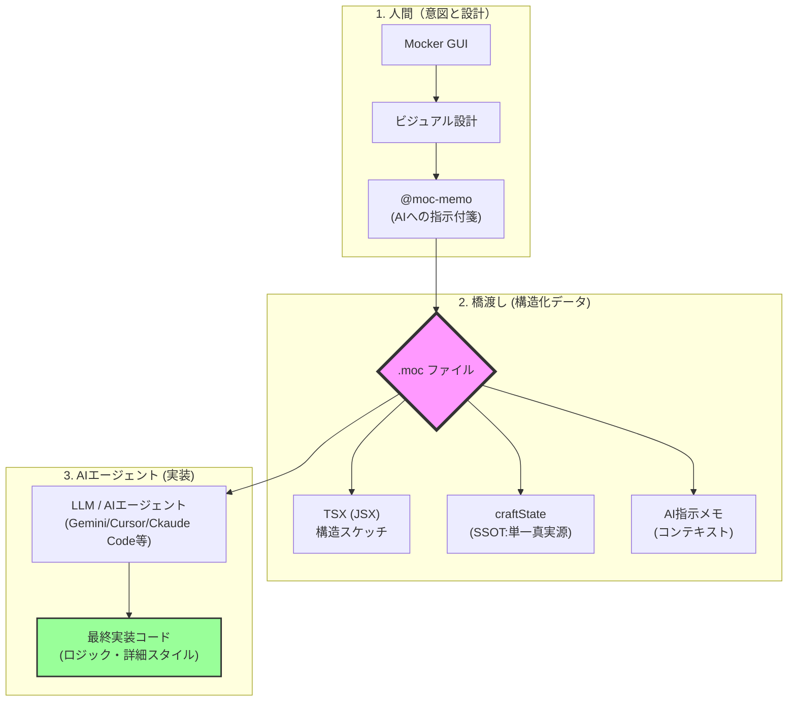
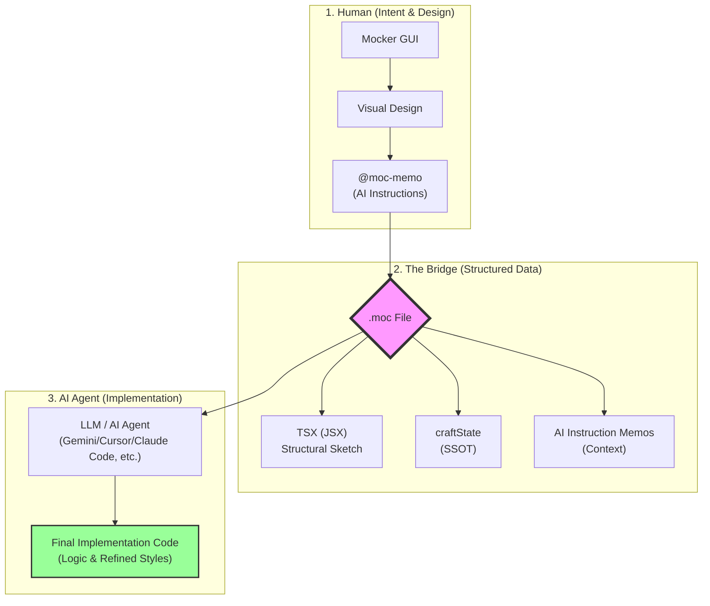

# Mocker
Visual Frontend Web UI Builder for VSCode
[English](#mockerenglish)

## 概要
VSCode上でGUI操作でWebのモック画面を作成する拡張機能です。  
現在コア機能開発中でありまともに動作はしない場合があります。  
また、コア機能開発中やアルファバージョンの開発中は破壊的な変更を加える可能性が非常に高いためご注意ください。  
  
> ※注 ご利用の際は、必ずプロジェクトをバックアップするか、実験的な環境でお試しください。


### コンセプト
- VSCode上でGUI操作によるモックアップの作成
- 出力された(単一もしくは連携される)ファイルと簡単なAIへの指示だけで本番環境への実装

> 出力されるファイル内に構造データと人間の意図を含ませることにより、AIが実装時に迷わず高度な再現を行うことを目的としています。

- [.mocファイル仕様](https://github.com/Mui-MuiMui/moc-spec) (Mockerの開発に合わせて変更する可能性があります。)
- [ファイル仕様の概念(思想)](https://github.com/Mui-MuiMui/AINDF) (.mocの元となる考え方、思想です。)



## 実装状況
[COMPONENT_STATUS](doc\COMPONENT_STATUS.md)  
こちらのチェックリストを使って導入進捗を管理しています。  

```
MVP作成 [v0.0.4をリリース済] 
↓
shadcn/uiのコンポーネントを追加 [現在対応中]
↓
プロパティ要素の拡充
↓
アイコン(SVG)配置機能の追加
↓
UIの整理 ←この段階でver1.0.0程度を見込んでいます。
```

---
# Mocker(English)
Visual Frontend Web UI Builder for VSCode
[日本語](#mocker)

## Overview
Mocker is a VSCode extension for creating web mockups via GUI.  
The project is currently in core development; some features may not function as expected.  
Please be aware that breaking changes are highly likely during core development and alpha stages.  
  
> Note: When using this extension, please ensure you back up your project or use an experimental environment.

## Concept
- Create mockups directly within VSCode using a GUI.
- Implement production-ready code using the output file and simple AI instructions.
- By embedding structural data and human intent within the file, Mocker aims to allow AI to perform high-fidelity implementations without confusion.
- [.moc File Specification](https://github.com/Mui-MuiMui/moc-spec) (Subject to change alongside Mocker development.)
- [Core Philosophy & Concepts](https://github.com/Mui-MuiMui/AINDF) (The underlying philosophy behind the .moc format.)

---




## Roadmap
[COMPONENT_STATUS](doc\COMPONENT_STATUS.md)

We use this checklist to manage implementation progress.

```
Build MVP [v0.0.4 Released]
↓
Add shadcn/ui Components [In Progress]
↓
Expand Property Options
↓
Add Icon (SVG) Support
↓
UI/UX Polish ← Expected around v1.0.0
```